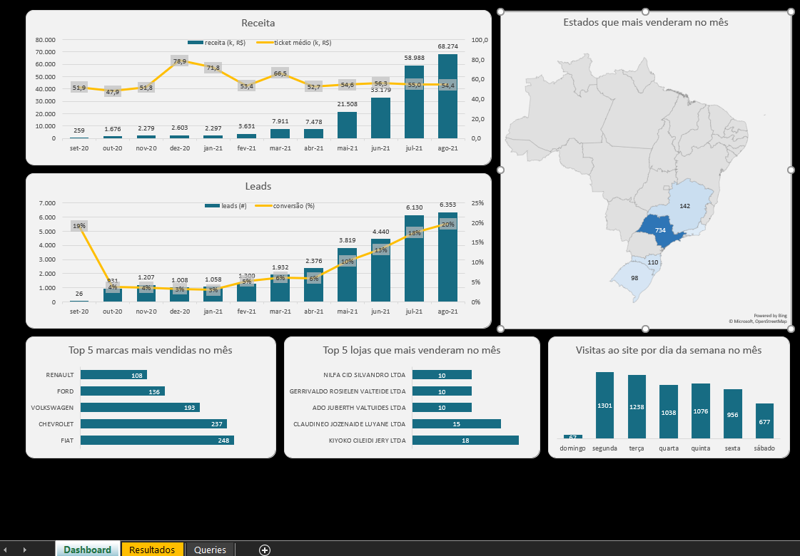

# 🚗 Análise de um E-commerce de Vendas de Veículos

## 💼 Sobre o Projeto

Este projeto consiste em uma análise exploratória de dados focada em um e-commerce do setor automotivo. O objetivo principal não foi apenas extrair números, mas sim responder a perguntas estratégicas de negócio para otimizar o funil de vendas, identificar gargalos e descobrir oportunidades de crescimento.

Utilizando **SQL (PostgreSQL)**, naveguei por um banco de dados relacional para unificar informações de leads, vendas, produtos e lojas.

## 🎯 Alguns dos desafios de Negócio Resolvidos

1. **Como está a evolução mensal de leads, conversão e ticket médio?**
2. **Quais estados impulsionam a maior parte da receita?**
3. **Quais montadoras/marcas dominam as vendas?**
4. **Qual o melhor dia da semana para disparar campanhas de marketing?**

## 🛠️ Ferramentas Utilizadas

* **Linguagem:** SQL (PostgreSQL).
* **Visualização(Output):** Excel/CSV para análise final.

### O Schema do Banco de Dados
A análise foi construída sobre o seguinte relacionamento de tabelas:

---

## 📊 Principais Insights Gerados

* **Sazonalidade de Vendas:** Nos meses de Julho e Agosto no ano de 2021 houve um aumento explosivo na receita,
* **Conversão Estável:** A taxa de conversão estabilizou-se entre **3% e 4%** ao longo dos meses.
* **Dominância Regional:** O eixo **Sudeste (SP, MG, RJ)** representa a vasta maioria das vendas, com SP liderando isoladamente
* **Padrão de Visitas:** O dia da semana com maior tráfego no site é a **Segunda-feira**, enquanto o Domingo tem o menor tráfego.

## 🚀 Recomendações Estratégicas

1.  **Otimização de Campanhas (Ads):**
    * Aumentar os anúncios nas **segundas e terças-feiras**, onde o tráfego orgânico e a intenção de compra já são altos.
    * Reduzir orçamento aos domingos para otimizar o ROAS (Retorno sobre Gasto em Anúncios).

2.  **Logística e Estoque:**
    * Priorizar centros de distribuição em **SP e MG**. O Sul (SC/RS) tem potencial, mas o foco logístico deve blindar o Sudeste para garantir entrega rápida e conversão alta.

3.  **Mix de Produtos:**
    * **Fiat e Chevrolet** são os "carros-chefe". Criar kits promocionais focado nessas marcas pode aumentar o Ticket Médio e a geração de receita.
